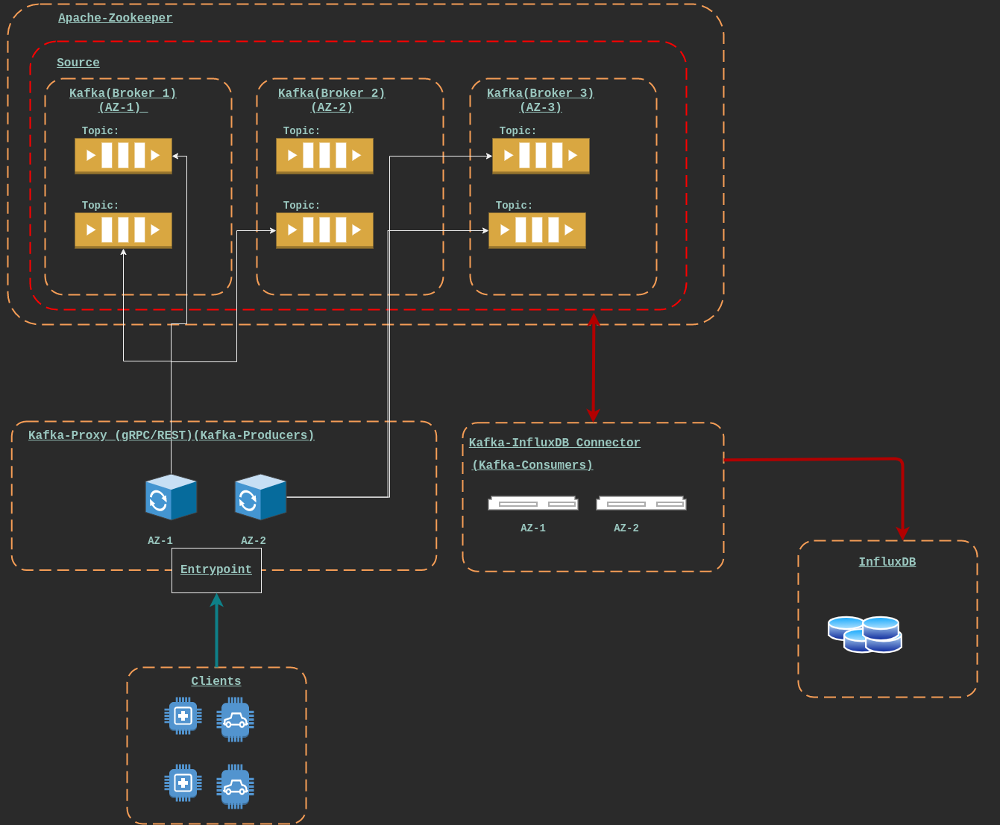

# Log Ingestor and Query Interface 

    

- Engineered a distributed data ingestion service in Go to handle high-throughput gRPC/REST client data. 
- Published data to Kafka topics, enabling decoupled, asynchronous communication between services. 
- Leveraged Zookeeper to eliminate Single Points of Failure (SPOF) and ensure high availability performance. 
- Developed a web interface for full-text search across logs stored in Elasticsearch for real-time retrieval.

## <u> Why do we need it? </u>

High-speed data ingestion poses a significant challenge, particularly when dealing with server-level logs generated by multiple microservices deployed in a production environment. These microservices produce logs at an incredibly high rate, making it crucial to capture every single log entry without any loss. Equally important is storing this data in a way that allows for efficient querying and analysis later on.

This is where a solution like this can make a difference. By utilizing a gRPC/REST proxy in conjunction with Kafka brokers, you can dynamically scale the system based on the incoming load, ensuring that no log packets are lost. The data is then saved to a write-intensive database like InfluxDB, designed to handle large volumes of time-series data efficiently. Leveraging the services built on top of InfluxDB, you can perform real-time analysis and querying, enabling comprehensive insights from your logs. [check this](https://www.influxdata.com/products/)

Also, while making this project I learned so many things and it gave me an excuse to solve one of the problems that I face a lot, dealing with server logs.

### <u>Performence</u>

These data points were obtained by running 1 instance of each service on a quad-core , 16 GB RAM pc. <br> </br>


### <u>Benchmarking</u>

I used [ghz](https://github.com/bojand/ghz) as a benchmarking tool

```sh
ghz --insecure --proto kafka-pixy.proto --call KafkaPixy/Produce
-d "{\"topic\":\"foo\",\"message\":\"SSBhdGUgYSBjbG9jayB5ZXN0ZXJkYXksIGl0IHdhcyB2ZXJ5IHRpbWUtY29uc3VtaW5nLg==\"}" -c 1000 -n 100 -z 5m 127.0.0.1:19091
```

### Tech stack and their use

| Tech             | Use                                                                                                                                                                                            |
| ---------------- | ---------------------------------------------------------------------------------------------------------------------------------------------------------------------------------------------- |
| apache-zookeeper | It manages different kafka brokers, choosing leader node , replacing nodes during failover.                                                                                                    |
| apache-kafka     | Messaging queue, queue of messages are stored as a `TOPIC` topics can span across different partitions and you have consumers to consume those messages and producers to put them on the queue |
| kafka-pixy       | The gRPC/REST based proxy server to contact the kafka-queue on behalf of your applications                                                                                                     |
| timberio/vector  | A very generic software to take data from your `SOURCE`(files,Kafka,statsD etc. ) does aggregation , enrichment etc . on it and saves them to the `SINK`(DB, S3 , files etc.)                  |
| influxDB         | A timeseries based DB                                                                                                                                                                          |

## <u>Architecture</u>



## <u>Alternative Methods</u>

These are just what I can think of right on top of my head.

- Use a 3rd party paid service for managing your data collection pipeline but, in the long run you will become dependent and as the data grows your cost will increase manifold.

- Create a proxy and start dumping everything on cache(Redis etc.) and create a worker to feed that to the database but, cache is expensive to maintain and there is only so much that you can store on the cache.

- Directly feed to the database but, you will be bounded by query/secs and will not receive reliable gRPC support for major databases.

## <u>Configurations </u>

In order to run, you need to configure the following-

1.  `kafka-pixy/kafka-pixy.yaml`

Point to your kafka broker(s)

```yaml
kafka:

seed_peers:
  - kafka-server1:9092
```

Point to your zookeeper

```yaml
zoo_keeper:

seed_peers:
  - zookeeper:2181
```

2.  `vector/vector.toml`

This `.toml` file will be used by [timberio/vector](https://github.com/timberio/vector) (which is :heart: btw) to configure your source (apache-kafka) and your sink(influxDB)

## <u>Usage </u>

The proxy ([kafka-pixy](https://github.com/mailgun/kafka-pixy)) opens up 2 ports for the communication.

| Port  | Protocol |
| ----- | -------- |
| 19091 | gRPC     |
| 19092 | HTTP     |

The [official repository](https://github.com/mailgun/kafka-pixy) does a great job :heart: in explaining how to connect with the proxy server but for the sake of simplicity, let me explain here.

#### Using REST based clients

It can be done like this (here foo is the topic name and bar is the group_id)

1. Produce a message on a topic

```bash

curl -X POST localhost:19092/topics/foo/messages?sync -d msg='sample message'

```

2. Consume a message from a topic

```bash

curl -G localhost:19092/topics/foo/messages?group=bar

```

### Using gRPC based clients

The [official repository](https://github.com/mailgun/kafka-pixy)(which is awesome, btw) provides the `.proto` file for the client, just produce the `stub` for the language of your choice(they have helper libraries for `go` and `python`) and you will be ready to go.

For the sake of simplicity, I have provided a [sample client]().

## <u>Running</u>

Simply run `docker-compose up` to setup the whole thing

### How to use in production :fire:

Some things that I can think of on top of my head -

1. Add a reverse-proxy(a load balancer maybe (?) ) that can communicate over to the pixy instances in different AZs

2. Configure `TLS` in the pixy , add password protection to `zookeeper` and configure proper policies for `influxdb`

3. Use any container orchestration tool (kubernetes or docker-swarm and all the fancy jazz) to scale up the servers whenever required.

## <u>Usecases</u>

Hippo can be used to handle high volume streaming data, some of the usecases that I can think of are -

1. Logging server logs produced by different microservices

2. IoT devices that generate large amount of data

## <u>TBD</u> (v2 maybe (?))

- [ ] Right now, the messages sent do not enforce any schema, this feature will be very useful while querying the influxdb (Add an enrichment layer to the connector itself, maybe (?))

- [x] Provide benchmarks

## <u>Acknowledgement</u>

This project wouldn't have been possible without some very very kickass os projects :fire:

1.  [kafka-pixy](https://github.com/mailgun/kafka-pixy)

2.  [timberio/vector](https://github.com/timberio/vector)

3.  [bitnami](https://bitnami.com/)

4.  [apache-kafka](https://github.com/apache/kafka)

5.  [apache-zookeeper](https://github.com/apache/zookeeper)

<br> <br>
